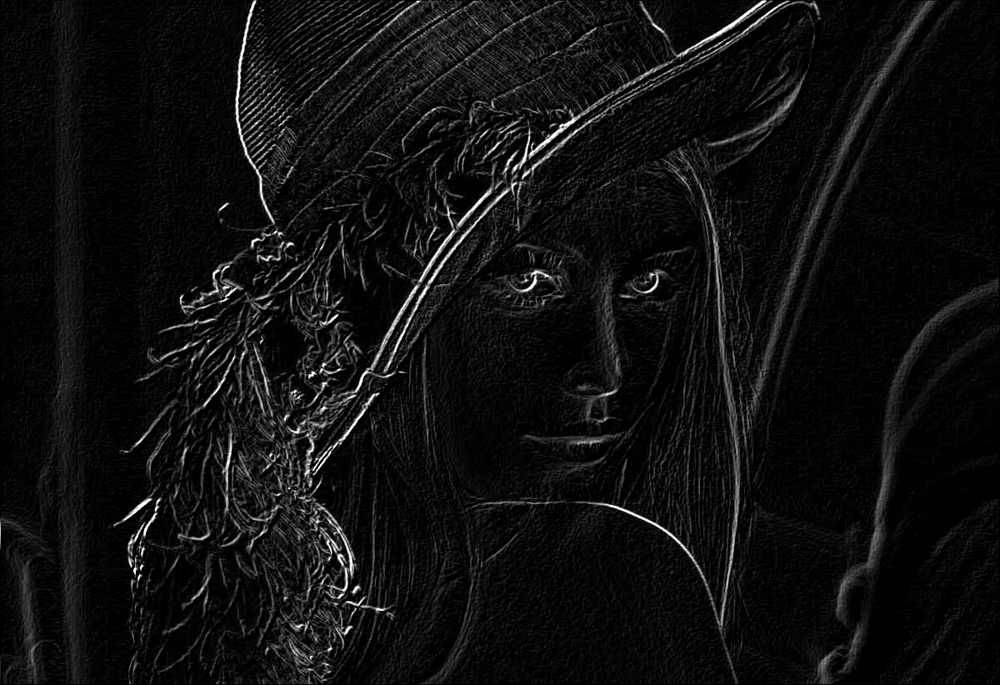

# Edge and Relief Detection in Images with Ruby Threads 🌄

The field of digital image processing and analysis has made remarkable strides in the early years of the 21st century. This progress has been fueled by a fervor for research and the development of technologies applicable to various domains, including medicine, biology, industrial automation, and remote sensing.

## 📸 Digital Image Processing

Digital image processing involves a suite of techniques for capturing, representing, and transforming images with the help of computers. This approach enables information extraction, structural enhancement, and automatic interpretation of images through computer programs. It enhances both human understanding and computational analysis of images.

## 🔍 Edge Detection

Edge detection is a critical aspect of image processing, facilitating the identification of significant transitions in pixel intensities and enabling object segmentation and analysis.

We employ convolution operations to detect edges in an M by N matrix image in both x and y directions, using masks as operators applied to pixels of interest and their neighbors. Several operators, such as the Prewitt operators, can be utilized for this task. The matrices like the ones below are instrumental:

```
Gx = |-1  0  1| ; Gy = |-1 -1 -1|
     |-1  0  1| ;      | 0  0  0|
     |-1  0  1| ;      | 1  1  1|
```

These matrices compute intensity variations in the x and y directions, allowing us to pinpoint edges.

Gx and Gy represent the masks used for edge detection in the x and y directions of the digital image. By applying these masks, we obtain separate edge images in both directions. The final segmented image is produced by amalgamating information from these two edge images.

## 🧮 Pseudocode for Problem Resolution

Given a grayscale image I with dimensions M × N, we perform the following:

  - Create an image (array) M × N, Gx, with all elements initialized to 0.
  - Create an image (array) M × N, Gy, with all elements initialized to 0.
  - Create an image (array) M × N, G, which can initially be set with all elements equal to zero.

The pseudocode for the calculations is outlined in the code block above.

```
# Calculating edge information
For i ranging from 1 to M-2
  For j ranging from 1 to N-2
    # Calculation of Gx...
    Gx(i, j) = [ I(i+1, j-1) + I(i+1, j) + I(i+1, j+1) ] - [ I(i-1, j-1) + I(i-1, j) + I(i-1, j+1) ]
    # Clamping...
    If Gx(i, j) < 0, Gx(i, j) = 0;
    If Gx(i, j) > 255, Gx(i, j) = 255;
  end-for
end-for

# Generating output image...
For i ranging from 0 to M-1
  For j ranging from 0 to N-1
    G(i, j) = Gx(i, j) + Gy(i, j)
    If G(i, j) > 255, G(i, j) = 255
  end-for
end-for
```

## 🛠️ Project

This project involves developing a Ruby program that utilizes threads to create two threads, one for obtaining the edge image in the x-direction and the other in the y-direction from an existing image. The main thread opens the input image, represents it using a suitable array, and then spawns two threads for calculating the edge images Gx and Gy. After their tasks are complete, the parent thread reads the two resulting image arrays to calculate the output image G.

## 🚀 Development

- The [main program](./src/main.rb) processes four distinct images located in the [assets folder](./assets).
- The project's core class is [ImageProcessing](./src/models/image_processing.rb), tailored exclusively for this problem. The code contains detailed information about methods and usage.
- The only library/gem used in this project is MiniMagick, as indicated in the Gemfile.
- No external libraries were required, not even for implementing threads, as Ruby 3.2.0 (2022-12-25 revision a528908271) [x86_64-linux] natively includes the [Thread class](https://ruby-doc.org/core-2.5.1/Thread.html).

## 📊 Results

| Original                   | Processed                        |
|:--------------------------:|:--------------------------------:|
|||
|    |   |
|  | |
|  | |

## 📚 References

- [Thread Ruby](https://ruby-doc.org/core-2.5.1/Thread.html)
- [MiniMagic Gem](https://rubygems.org/gems/mini_magick/versions/4.5.1?locale=en)
- [Ruby doc 3.2.0](https://ruby-doc.org/3.2.0/)

---

<div align="center">
  📚 DCA0108 - Operating Systems (2023.1) 🎓 <br/>
  Federal University of Rio Grande do Norte - Department of Computer and Automation Engineering (DCA). 🏛️
</div>